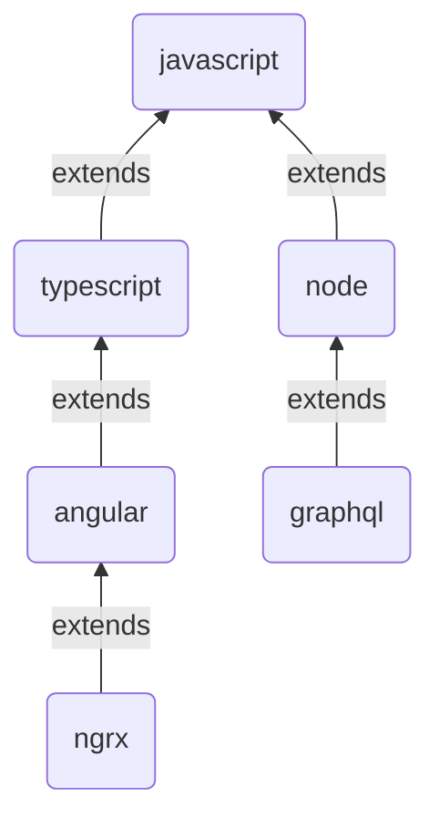

# @code-pushup/eslint-config

[](https://www.npmjs.com/package/@code-pushup/eslint-config)
[](https://opensource.org/licenses/MIT)

Recommended ESLint presets by [Code PushUp](https://github.com/code-pushup/cli/tree/main/packages/cli).

<!-- begin autogenerated -->

## ⚙️ Configs

|                        Stack                        | Config                             | Description                                                         |
| :-------------------------------------------------: | :--------------------------------- | :------------------------------------------------------------------ |
|  | [javascript](./docs/javascript.md) | Default config, suitable for any **JavaScript/TypeScript** project. |
|  | [typescript](./docs/typescript.md) | Config for strict **TypeScript** projects.                          |
|          | [node](./docs/node.md)             | Config for **Node.js** projects.                                    |
|        | [angular](./docs/angular.md)       | Config for **Angular** projects.                                    |
|                 | [ngrx](./docs/ngrx.md)             | Config for **Angular** projects using **NgRx** library.             |
|        | [graphql](./docs/graphql.md)       | Config for **GraphQL servers** implemented in Node.js.              |
|              | [jest](./docs/jest.md)             | Config for projects using **Jest** for testing.                     |
|          | [vitest](./docs/vitest.md)         | Config for projects using **Vitest** for testing.                   |
|        | [cypress](./docs/cypress.md)       | Config for projects using **Cypress** for testing.                  |
|  | [playwright](./docs/playwright.md) | Config for projects using **Playwright** for testing.               |
|    | [storybook](./docs/storybook.md)   | Config for projects using **Storybook** for UI components.          |

Some configs extend other configs, as illustrated below. So, for example, extending `angular` config implicitly extends `typescript` and `javascript` configs as well.



### 🏗️ Setup

To use the default config, follow these steps:

1. You must first install all the required peer dependencies (if you haven't already):

   ```sh
   npm install -D eslint @eslint/js eslint-plugin-{functional,import,promise,sonarjs,unicorn} globals typescript-eslint
   ```

2. Install `@code-pushup/eslint-config` with:

   ```sh
   npm install -D @code-pushup/eslint-config
   ```

3. Include default config in your [ESLint configuration file](https://eslint.org/docs/latest/use/configure/configuration-files) (usually `eslint.config.js`):

   ```js
   import javascript from '@code-pushup/eslint-config/javascript.js';
   import tseslint from 'typescript-eslint';
   
   export default tseslint.config(...javascript);
   ```

Depending on your tech stack, you may wish to extend other configs as well ([listed above](#⚙️-configs)). This will require installing additional peer dependencies. For more details, refer to setup docs for the configs you're interested in using.

#### 📦 Peer dependencies

All peer dependencies used by `@code-pushup/eslint-config` are listed below, along with their supported versions. Only the default config's dependencies are required, others are optional.

|                                                     | NPM package                                                                                          |  Version   | Required |
| :-------------------------------------------------: | :--------------------------------------------------------------------------------------------------- | :--------: | :------: |
|          | [eslint](https://www.npmjs.com/package/eslint)                                                       |  `^9.0.0`  |    ✅     |
|          | [@eslint/js](https://www.npmjs.com/package/@eslint/js)                                               |  `^9.0.0`  |    ✅     |
|            | [eslint-plugin-functional](https://www.npmjs.com/package/eslint-plugin-functional)                   |  `^7.0.0`  |    ✅     |
|            | [eslint-plugin-import](https://www.npmjs.com/package/eslint-plugin-import)                           | `^2.31.0`  |    ✅     |
|            | [eslint-import-resolver-typescript](https://www.npmjs.com/package/eslint-import-resolver-typescript) |  `^3.0.0`  |          |
|          | [eslint-plugin-promise](https://www.npmjs.com/package/eslint-plugin-promise)                         | `>=6.4.0`  |    ✅     |
|               | [eslint-plugin-sonarjs](https://www.npmjs.com/package/eslint-plugin-sonarjs)                         |  `^1.0.4`  |    ✅     |
|          | [eslint-plugin-unicorn](https://www.npmjs.com/package/eslint-plugin-unicorn)                         | `>=50.0.0` |    ✅     |
|            | [globals](https://www.npmjs.com/package/globals)                                                     | `>=14.0.0` |    ✅     |
|  | [typescript-eslint](https://www.npmjs.com/package/typescript-eslint)                                 |  `^8.0.0`  |    ✅     |
|        | [@graphql-eslint/eslint-plugin](https://www.npmjs.com/package/@graphql-eslint/eslint-plugin)         |  `^3.0.0`  |          |
|                 | [@ngrx/eslint-plugin](https://www.npmjs.com/package/@ngrx/eslint-plugin)                             | `^18.0.0`  |          |
|        | [angular-eslint](https://www.npmjs.com/package/angular-eslint)                                       | `^18.0.0`  |          |
|        | [eslint-plugin-cypress](https://www.npmjs.com/package/eslint-plugin-cypress)                         | `>=3.3.0`  |          |
|              | [eslint-plugin-jest](https://www.npmjs.com/package/eslint-plugin-jest)                               | `^28.8.0`  |          |
|                | [eslint-plugin-jest-formatting](https://www.npmjs.com/package/eslint-plugin-jest-formatting)         |  `^3.0.0`  |          |
|          | [eslint-plugin-n](https://www.npmjs.com/package/eslint-plugin-n)                                     | `>=17.0.0` |          |
|  | [eslint-plugin-playwright](https://www.npmjs.com/package/eslint-plugin-playwright)                   |  `^2.1.0`  |          |
|                 | [eslint-plugin-rxjs-x](https://www.npmjs.com/package/eslint-plugin-rxjs-x)                           | `>=0.6.0`  |          |
|    | [eslint-plugin-storybook](https://www.npmjs.com/package/eslint-plugin-storybook)                     | `>=0.10.0` |          |
|          | [eslint-plugin-vitest](https://www.npmjs.com/package/eslint-plugin-vitest)                           | `>=0.5.0`  |          |

### 🧪 Test overrides

For non-production code, some rules are disabled (or downgraded from errors to warnings).

This applies to file paths matching any of the following globs:

- `**/*.spec.?(c|m)[jt]s?(x)`
- `**/*.test.?(c|m)[jt]s?(x)`
- `**/__tests__/**/*.?(c|m)[jt]s?(x)`
- `**/__mocks__/**/*.?(c|m)[jt]s?(x)`
- `**/*.cy.?(c|m)[jt]s?(x)`
- `**/*.stories.?(c|m)[jt]s?(x)`
- `**/*.e2e.?(c|m)[jt]s?(x)`
- `**/*.mock.?(c|m)[jt]s?(x)`
- `**/*.mocks.?(c|m)[jt]s?(x)`
- `**/test/**/*.?(c|m)[jt]s?(x)`
- `**/tests/**/*.?(c|m)[jt]s?(x)`
- `**/mocks/**/*.?(c|m)[jt]s?(x)`
- `**/testing-utils/**/*.?(c|m)[jt]s?(x)`
- `**/test-utils/**/*.?(c|m)[jt]s?(x)`
- `**/fixtures/**/*.?(c|m)[jt]s?(x)`
- `**/*.config.?(c|m)[jt]s`
- `**/.prettierrc.?(c|m)[jt]s`
- `**/codegen.?(c|m)[jt]s`
- `**/test-setup.?(c|m)[jt]s`

<!-- end autogenerated -->

## 🫴 Contributing

Node.js installation is a prerequisite (LTS version). Install dependencies with NPM:

```sh
npm install
```

To execute tests:

```sh
npm test
```

To generate documentation:

```sh
npm run docs
```
