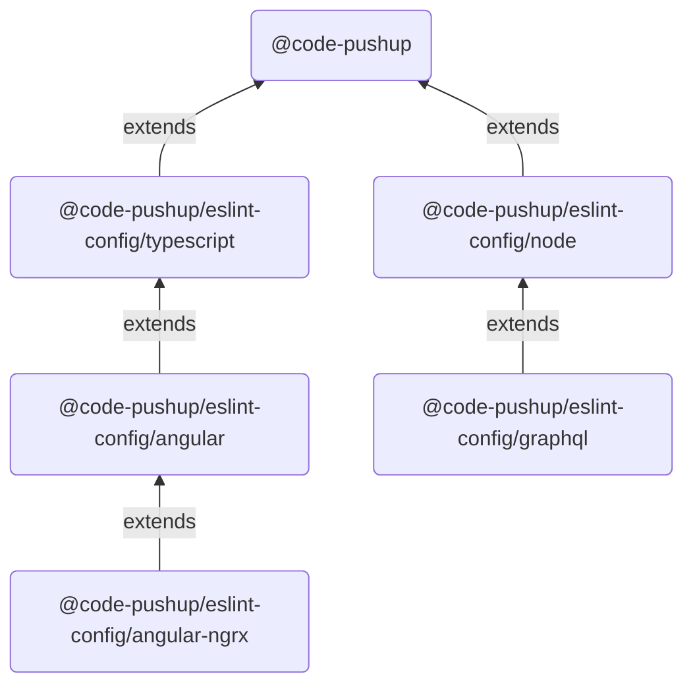

# @code-pushup/eslint-config

[](https://www.npmjs.com/package/@code-pushup/eslint-config)
[](https://opensource.org/licenses/MIT)

Recommended ESLint presets by [Code PushUp](https://github.com/code-pushup/cli/tree/main/packages/cli).

<!-- begin autogenerated -->

## ⚙️ Configs

Configurations are available for different tech stacks.

| Stack | Config | Description |
| :-: | :-- | :-- |
|  | [@code-pushup](https://github.com/code-pushup/eslint-config/blob/main/docs/index.md) | Default config, suitable for any **JavaScript/TypeScript** project. |
|  | [@code-pushup/eslint-config/typescript](https://github.com/code-pushup/eslint-config/blob/main/docs/typescript.md) | Config for strict **TypeScript** projects. |
|  | [@code-pushup/eslint-config/node](https://github.com/code-pushup/eslint-config/blob/main/docs/node.md) | Config for **Node.js** projects. |
|  | [@code-pushup/eslint-config/angular](https://github.com/code-pushup/eslint-config/blob/main/docs/angular.md) | Config for **Angular** projects. |
|  | [@code-pushup/eslint-config/angular-ngrx](https://github.com/code-pushup/eslint-config/blob/main/docs/angular-ngrx.md) | Config for **Angular** projects using **NgRx** library. |
|  | [@code-pushup/eslint-config/graphql](https://github.com/code-pushup/eslint-config/blob/main/docs/graphql.md) | Config for **GraphQL servers** implemented in Node.js. |
|  | [@code-pushup/eslint-config/jest](https://github.com/code-pushup/eslint-config/blob/main/docs/jest.md) | Config for projects using **Jest** for testing. |
|  | [@code-pushup/eslint-config/vitest](https://github.com/code-pushup/eslint-config/blob/main/docs/vitest.md) | Config for projects using **Vitest** for testing. |
|  | [@code-pushup/eslint-config/cypress](https://github.com/code-pushup/eslint-config/blob/main/docs/cypress.md) | Config for projects using **Cypress** for testing. |
|  | [@code-pushup/eslint-config/storybook](https://github.com/code-pushup/eslint-config/blob/main/docs/storybook.md) | Config for projects using **Storybook** for UI components. |

Some configs extend other configs, as illustrated below. So, for example, adding `"extends": ["@code-pushup/eslint-config/angular"]` implicitly includes `@code-pushup/eslint-config/typescript` and `@code-pushup` as well.



### 🏗️ Setup

To use the default config, follow these steps:

1. You must first install all the required peer dependencies (if you haven't already):
   
   ```sh
   npm install -D eslint @typescript-eslint/{eslint-plugin,parser} eslint-plugin-{functional,import,no-secrets,promise,sonarjs,unicorn}
   ```
2. Install `@code-pushup/eslint-config` with:
   
   ```sh
   npm install -D @code-pushup/eslint-config
   ```
3. Add default config to `extends` section in your [ESLint configuration file](https://eslint.org/docs/latest/use/configure/configuration-files) (usually called `.eslintrc.json` or `.eslintrc.js`):
   
   ```json
   {
     "extends": ["@code-pushup"]
   }
   ```


Depending on your tech stack, you may wish to extend other configs as well ([listed above](#⚙️-configs)). This will require installing additional peer dependencies. For more details, refer to setup docs for the configs you're interested in using.

#### 📦 Peer dependencies

All peer dependencies used by `@code-pushup/eslint-config` are listed below, along with their supported versions. Only the default config's dependencies are required, others are optional.

|  | NPM package | Version | Required |
| :-: | :-- | :-: | :-: |
|  | [eslint](https://www.npmjs.com/package/eslint) | `^8.0.0` | ✅ |
|  | [@typescript-eslint/eslint-plugin](https://www.npmjs.com/package/@typescript-eslint/eslint-plugin) | `^6.0.0` | ✅ |
|  | [@typescript-eslint/parser](https://www.npmjs.com/package/@typescript-eslint/parser) | `^6.0.0` | ✅ |
|  | [eslint-plugin-functional](https://www.npmjs.com/package/eslint-plugin-functional) | `^6.0.0` | ✅ |
|  | [eslint-plugin-import](https://www.npmjs.com/package/eslint-plugin-import) | `^2.25.0` | ✅ |
|  | [eslint-import-resolver-typescript](https://www.npmjs.com/package/eslint-import-resolver-typescript) | `^3.0.0` |  |
|  | [eslint-plugin-no-secrets](https://www.npmjs.com/package/eslint-plugin-no-secrets) | `^0.8.0` | ✅ |
|  | [eslint-plugin-promise](https://www.npmjs.com/package/eslint-plugin-promise) | `^6.0.0` | ✅ |
|  | [eslint-plugin-sonarjs](https://www.npmjs.com/package/eslint-plugin-sonarjs) | `>=0.22.0` | ✅ |
|  | [eslint-plugin-unicorn](https://www.npmjs.com/package/eslint-plugin-unicorn) | `>=48.0.0` | ✅ |
|  | [@angular-eslint/eslint-plugin](https://www.npmjs.com/package/@angular-eslint/eslint-plugin) | `^17.0.0` |  |
|  | [@angular-eslint/eslint-plugin-template](https://www.npmjs.com/package/@angular-eslint/eslint-plugin-template) | `^17.0.0` |  |
|  | [@angular-eslint/template-parser](https://www.npmjs.com/package/@angular-eslint/template-parser) | `^17.0.0` |  |
|  | [@graphql-eslint/eslint-plugin](https://www.npmjs.com/package/@graphql-eslint/eslint-plugin) | `^3.0.0` |  |
|  | [@ngrx/eslint-plugin](https://www.npmjs.com/package/@ngrx/eslint-plugin) | `^17.0.0` |  |
|  | [eslint-plugin-cypress](https://www.npmjs.com/package/eslint-plugin-cypress) | `^2.0.0` |  |
|  | [eslint-plugin-deprecation](https://www.npmjs.com/package/eslint-plugin-deprecation) | `^2.0.0` |  |
|  | [eslint-plugin-jest](https://www.npmjs.com/package/eslint-plugin-jest) | `^27.0.0` |  |
|  | [eslint-plugin-n](https://www.npmjs.com/package/eslint-plugin-n) | `^16.0.0` |  |
|  | [eslint-plugin-rxjs](https://www.npmjs.com/package/eslint-plugin-rxjs) | `^5.0.0` |  |
|  | [eslint-plugin-storybook](https://www.npmjs.com/package/eslint-plugin-storybook) | `^0.6.0` |  |
|  | [eslint-plugin-vitest](https://www.npmjs.com/package/eslint-plugin-vitest) | `^0.3.0` |  |

### 🧪 Test overrides

For non-production code, some rules are disabled (or downgraded from errors to warnings).

This applies to file paths matching any of the following globs:

- `*.spec.?(c|m)[jt]s?(x)`
- `*.test.?(c|m)[jt]s?(x)`
- `**/__tests__/**/*.?(c|m)[jt]s?(x)`
- `**/__mocks__/**/*.?(c|m)[jt]s?(x)`
- `*.cy.?(c|m)[jt]s?(x)`
- `*.stories.?(c|m)[jt]s?(x)`
- `*.e2e.?(c|m)[jt]s?(x)`
- `*.mock.?(c|m)[jt]s?(x)`
- `*.mocks.?(c|m)[jt]s?(x)`
- `**/test/**/*.?(c|m)[jt]s?(x)`
- `**/tests/**/*.?(c|m)[jt]s?(x)`
- `**/mocks/**/*.?(c|m)[jt]s?(x)`
- `**/testing-utils/**/*.?(c|m)[jt]s?(x)`
- `**/test-utils/**/*.?(c|m)[jt]s?(x)`
- `**/fixtures/**/*.?(c|m)[jt]s?(x)`

<!-- end autogenerated -->
